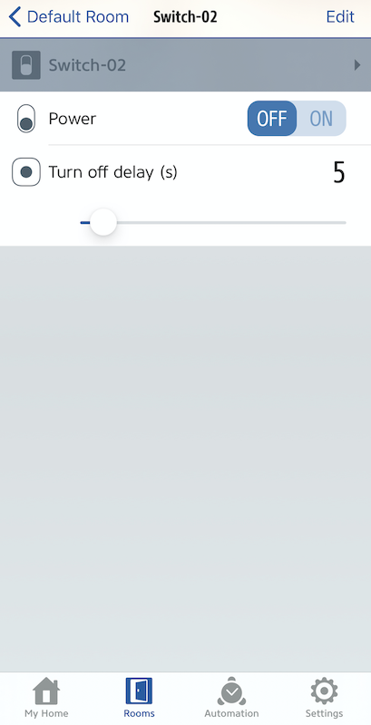

# homebridge-cmdtriggerswitch

[](https://www.npmjs.com/package/homebridge-cmdtriggerswitch)
[](https://www.npmjs.com/package/homebridge-cmdtriggerswitch)

A fake switch for Homebridge that triggers a CLI command when turned on or off.

## Installation

1. Install Homebridge, see https://homebridge.io/.
2. Install this plugin using: `npm install --save homebridge-cmdtriggerswitch@latest`.
3. Update your Homebridge `config.json` using the sample below.

Example config.json with a stateful switch:
```
    "accessories": [
        {
            "accessory": "CmdTriggerSwitch",
            "name": "Heating,
            "stateful": true,
            "onCmd": "echo Heating ON",
            "offCmd": "echo Heating OFF"
        }
    ]
```

Example config.json with a (simulated) stateless switch:
```
    "accessories": [
        {
            "accessory": "CmdTriggerSwitch",
            "name": "Switch-01,
            "stateful": false,
            "onCmd": "echo Switch-01 is now ON",
            "offCmd": "echo Switch-01 is now OFF",
            "delay": 1000
        }
    ]
```

With this plugin, you can create any number of fake switches that will execute a CLI command when turned off or on. This is usefull to trigger commands that are executed on the server running homebridge. This can be very useful for advanced automation with HomeKit scenes like sending an email when a scene becomes active. Or you could tell Siri to start a backup.

## Stateful Switches

The default behavior of a statefull CmdTriggerSwitch is that it remains on and must be manually turned off. You can do this by passing the 'stateful' argument with the value true in your config.json:

```
    "accessories": [
        {
            "accessory": "CmdTriggerSwitch",
            "name": "Switch-02,
            "stateful": true,
            "onCmd": "echo Switch-02 is now ON",
            "offCmd": "echo Switch-02 is now OFF"
        }
    ]
```
The argument 'onCmd' is used to specifiy the CLI command that is executed when the switch is turned on and the argument 'offCmd' is used to spedify the CLI command that is executed when the switch is turned off.


## Stateless Switches

You may also want to create a stateless CmdTriggerSwitch that turns itself off after being on for a given time (for example, five seconds). This can be done by passing the 'stateful' argument with the value false and the 'delay' argument with the timeout value (in milliseconds) in your config.json:

```
    "accessories": [
        {
            "accessory": "CmdTriggerSwitch",
            "name": "Switch-01,
            "stateful": false,
            "onCmd": "echo Switch-01 is now ON",
            "offCmd": "echo Switch-01 is now OFF",
            "delay": 5000
        }
    ]
```
The argument 'onCmd' is used to specifiy the CLI command that is executed when the switch is turned on and the argument 'offCmd' is used to spedify the CLI command that is executed when the switch is turned off.

The default unit for the argument 'delay' is milliseconds. You can change this by specifing the argument 'delayUnit' which accepts the values 'ms' for milliseconds, 's' for seconds and 'min' for minutes.

### Interactive Delay

The timeout value for a stateless switch can be directly changed in a supported HomeKit app like 'Eve for HomeKit', if the flag 'interactiveDelayLabel' is set to true.  Unfortunately, this is not possible in the official Apple Home app as it does not support custom characteristic. Still, it can be used in the official Apple Home app.

```
    "accessories": [
        {
            "accessory": "CmdTriggerSwitch",
            "name": "Switch-02",
            "stateful": false,
            "onCmd": "echo Switch-01 is now ON",
            "offCmd": "echo Switch-01 is now OFF",
            "delay": 5,
            "delayUnit": "s",
            "interactiveDelaySettings": {
                "interactiveDelay": true,
                "interactiveDelayLabel": "Turn off delay",
                "delayMin": 5,
                "delayMax": 100,
                "delayStep": 1
            }
        }
    ]
```
The appearance in 'Eve for HomeKit' of the above example is depicted below:



## Arguments

| Argument  | Description                                                                | Required |
|-----------|----------------------------------------------------------------------------|----------|
| accessory | Must always be `CmdTriggerSwitch`.                                         | Yes      |
| name      | Name of the switch. Must be unique.                                        | Yes      |
| stateful  | Flag to indicate if the switch is stateful (true) or stateless (false).    | Yes      |
| onCmd     | CLI command that is executed when the switch is turned on.                 | No       |
| offCmd    | CLI command that is executed when the switch is turned off.                | No       |
| delay     | Timeout value in the unit specified by the argument 'delayUnit' after which the switch turns off itself. If not specified, defaults to 100 units. Only evaluated for stateless switches. If interactiveDelay is specified, this specifies the initial value.         | No       |
| delayUnit | Unit in which the values for 'delay' are specified. Accepts 'ms' for milliseconds, 's' for seconds and 'min' for minutes. If not specified, default to milliseconds.     | No       |
| interactiveDelay | Flag to indicate if the timeout value for a stateless switch can be directly changed in a supported HomeKit app like 'Eve for HomeKit'. This is not possible in the official Apple Home app as it does not support custom characteristic. Defaults to false.          | No       | 
| interactiveDelayLabel | Specifies the label that is used to display the interactive delay value. Defaults to 'Delay'. Note: The unit is always appended. Only evaluated if 'interactiveDelay' is true.    | No       |
| delayMin  | Minimum timeout value that can be set interactively for a stateless switch. Defaults to 100. Only evaluated if 'interactiveDelay' is true.              | No       |
| delayMax  | Maximum timeout value that can be set interactively for a stateless switch. Defaults to 1000. Only evaluated if 'interactiveDelay' is true.              | No       |
| delayStep  | Step value used to increment or decrement the timeout value that can be set interactively for a stateless switch. Defaults to 100. Only evaluated if 'interactiveDelay' is true.              | No       |

